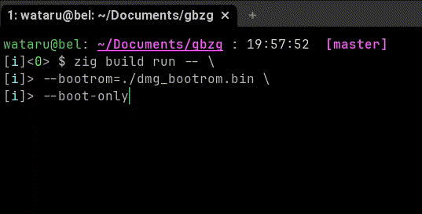
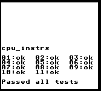
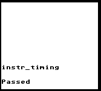

# gbzg: GameBoy Emulator written in Zig

Forked from [gb-emu](https://github.com/take44444/gb-emu).


|  |
|:--:|
| *Boot [Free ROM](https://github.com/take44444/Gameboy-free_bootrom)* |

|  |  |
|:--:|:--:|
| [Blargg cpu_instrs](https://github.com/retrio/gb-test-roms/tree/master/cpu_instrs) test | [Blargg instr_timing](https://github.com/retrio/gb-test-roms/tree/master/instr_timing) test |

## Build

```sh
zig build run
```

## Renderer

For now, [Sixel](https://github.com/saitoha/libsixel) is supported as a LCD renderer.
You can install dependencies by following command.

```sh
sudo apt install libsixel-dev
```

Note that your terminal must support Sixel encoding.
Major candidate would be [WezTerm](https://wezfurlong.org/wezterm/index.html).
