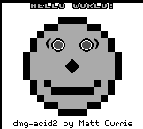

# gbzg: GameBoy (DMG/CGB) Emulator written in Zig

Forked from [gb-emu](https://github.com/take44444/gb-emu).


|  |
|:--:|
| *Boot [Free ROM](https://github.com/take44444/Gameboy-free_bootrom)* |

|  |  |
|:--:|:--:|
| [Blargg cpu_instrs](https://github.com/retrio/gb-test-roms/tree/master/cpu_instrs) test | [Blargg instr_timing](https://github.com/retrio/gb-test-roms/tree/master/instr_timing) test |
|  |  |
| [Blargg mem_timing](https://github.com/retrio/gb-test-roms/tree/master/mem_timing) test | [Blargg mem_timing2](https://github.com/retrio/gb-test-roms/tree/master/mem_timing-2) test |
|  |  |
| [dmg-acid2](https://github.com/mattcurrie/dmg-acid2) PPU test | [cgb-acid2](https://github.com/mattcurrie/cgb-acid2) PPU test |

## 🏗️ Build

`zig build` command installs the binary to `zig-out/bin/gbzg`.
Also, you can run the emulator by following command:

```sh
zig build run -- --bootrom=</path/to/bootrom> --cart=</path/to/cartridge>
```

## 🤝 External Interface

### 🎨 Renderer

For now, [Sixel](https://github.com/saitoha/libsixel) is supported as a LCD renderer.
You can install dependencies by following command.

```sh
sudo apt install libsixel-dev
```

Note that your terminal must support Sixel encoding.
Major candidate would be [WezTerm](https://wezfurlong.org/wezterm/index.html).

### 🎮 Joypad

For now, keyboard input is supported as a joypad.
To watch user key inputs in background, this emulator uses `epoll()`.
Your OS must support `epoll()` system call.

## 🧑‍💻 Development

- You can run unit tests by `zig build test`.
- Default output is optimized for speed. You can change the option in `build.zig`. Available options are `Debug`, `ReleaseSafe`, `ReleaseFast`, `ReleaseSmall`.
